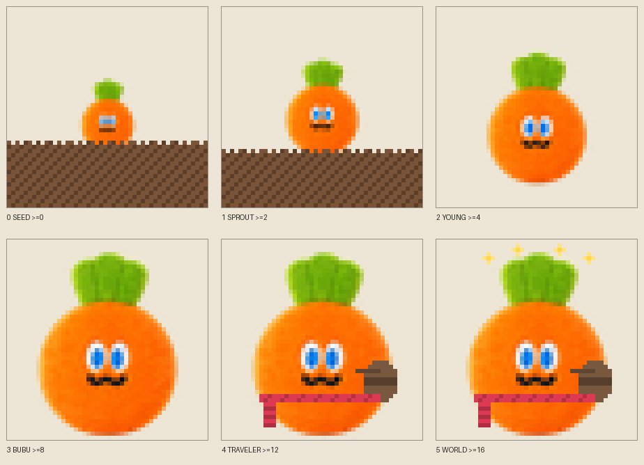

  <a href="README.md">English</a> · <strong>简体中文</strong>

# 卜卜通行证

> 让 wmls 在人群里认出彼此。

《卜卜通行证》是一个给五迷老师玩的匿名相遇游戏。

它不会要求你加好友，也不会交换姓名和联系方式。两台通行证在附近认出彼此时，只会亮起一个小小的提示：

**“这里还有一位老师。”**

有时，一次不打扰的相认就够了。

## 三件最重要的事

### 1. 戴上自己的暗号

出门前，可以从这些符号里选一个：

- 萝卜
- 兔子
- 九号球
- 红、黄、蓝、绿、粉五色球

也可以选一句当下的状态，例如“HELLO”“COFFEE BREAK”或“NEED HELP”。

当附近出现同圈子的通行证，双方会看到相遇提示。没有好友申请，也没有社交压力。

### 2. 九号球不是身份，是今天的心情

九号球代表“我今天不太好，但不一定想说很多”。

收到九号球时，不会播放热闹动画和提示音，只会显示一行安静的文字。另一位老师可以按下 `OK` 回应：

**“附近有人陪了你一下。”**

回应只发给这次遇见的匿名通行证，不会建立好友关系，也不会留下联系方式。

### 3. 带卜卜去看更多地方

卜卜只记一件事：你带它去过多少个不同的地方。

**种子 → 芽 → 幼卜 → 卜卜 → 旅卜 → 世界卜**

它只长大，不掉级。久不出门也不会失去已经走过的路。

## 怎么一起玩

### 一台通行证

一台设备也可以养卜卜、发现新地点、查看本次开机走过的轨迹，并慢慢解锁六个成长阶段。

### 两台通行证

1. 两台设备都打开 `Places`。
2. 在 `TRIBE ICON` 中选好自己的符号。
3. 关闭 `STEALTH`，保持双方在附近。
4. 等待自动发现；通常会在一个约 60 秒的周期内出现结果。
5. 如果遇到九号球，留在 `LIVE` 页面，按 `OK` 送出一次安静回应。

这里没有配对过程。它更像演唱会散场时在人群中看到一件熟悉的衣服：认出来，然后各自继续往前走。

## 还能发现什么

- **地点档案**：记录常去的环境，不保存 GPS 坐标。
- **本次轨迹**：看看这次开机后经过了哪些地方。
- **熟客**：自愿开启后，只按匿名编号统计重复相遇。
- **聚集彩蛋**：附近出现许多同好时，留下这一刻的纪念。
- **隐身模式**：只看附近，不让别人看见自己。
- **重新生成身份**：随时更换匿名编号，从头开始。

## 三个按键就够了

| 按键 | 作用 |
| --- | --- |
| `UP` / `DOWN` | 切换页面或选项 |
| `OK` | 确认、切换暗号、回应九号球 |
| 长按 `OK` | 返回主菜单 |

## 我们不想知道你是谁

- 不交换姓名、手机号或社交账号。
- 不支持自由文本，避免陌生人骚扰。
- 不记录 GPS 位置。
- 相遇使用随机匿名编号，可以手动重新生成。
- 地点、成长和熟客记录保存在自己的设备里。

这不是一个“认识更多人”的工具，而是一种更轻的陪伴：知道彼此在场，就够了。

## 获取与安装

你可以从本仓库的 [Releases](https://github.com/chenjie1129/MayDayFansInTraePassport/releases) 下载完整固件，再使用 [AI Passport 在线刷机工具](https://ai-passport.folotoy.cn/tools/web-flasher/) 写入设备。

刷写前请确认使用本项目提供的 `FoloToy-AI-Passport-full.bin`，并保留设备原有身份与恢复区域。

## 给想一起改进它的老师

代码、测试和硬件资料仍然完整保留：

- [完整文档索引](INDEX.zh_CN.md)
- [构建与测试](development/build-and-test.zh_CN.md)
- [固件兼容与保护分区](development/ble-recovery-compatibility.zh_CN.md)
- [贡献指南](../.github/CONTRIBUTING.zh_CN.md)

项目使用 ESP-IDF 与 LVGL，核心协议、地点识别、熟客淘汰和卜卜成长逻辑均提供可脱离硬件运行的测试。

## 说明

这是五迷共创的个人、非商业项目，不是五月天或相关团队的官方产品。卜卜参考素材的来源与使用边界见 [素材说明](../main/assets/source/NOTICE.zh_CN.md)。
